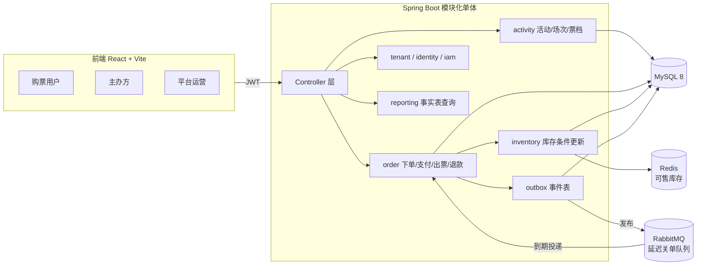

# EventFlow

活动售票平台的模块化单体实现。主办方发布活动与票档，购票用户下单、模拟支付、拿到无座电子票，平台运营负责入驻审核与跨租户监管。

项目的重点不是功能数量，而是**票务场景下的库存正确性与最终一致性**：并发下单不超卖、支付出票幂等、超时关单可靠、退款回补库存、多租户数据不串。功能边界与状态机的完整定义在 [`docs/PROJECT-CONTRACT.md`](docs/PROJECT-CONTRACT.md)，阶段性取舍与"为什么不做"在 [`docs/DECISIONS.md`](docs/DECISIONS.md)。

## 技术栈

| 层 | 选型 |
|---|---|
| 运行时 | JDK 17 |
| 后端 | Spring Boot 3.3，模块化单体 |
| 安全 | Spring Security 6 + JWT 无状态鉴权 |
| 持久化 | MyBatis + Flyway，MySQL 8 |
| 缓存 | Redis 7（库存预扣的 Lua 脚本） |
| 消息 | RabbitMQ（TTL + 死信队列做延迟关单） |
| 测试 | JUnit 5 + Testcontainers（MySQL / Redis / RabbitMQ 真实容器） |
| 前端 | React 18 + TypeScript + Vite，TanStack Query，React Hook Form + Zod，Ant Design |
| 运维 | Docker Compose、Nginx、Prometheus + Grafana、k6 |

## 架构



后端按领域划分包，运行时仍是单一应用：`tenant` / `identity` / `iam` / `activity` / `inventory` / `order` / `payment` / `ticket` / `refund` / `notification` / `reporting` / `audit` / `platform` / `shared` / `boot`。前端 `web/src/modules/*` 与后端领域一一对应。

## 核心设计

### 库存：Redis Lua 预扣 + MySQL 条件更新

下单先用 Lua 脚本在 Redis 上原子扣减可售数，挡住大部分无效请求；真正的库存真相仍在 MySQL，靠条件更新保证不超卖：

```sql
UPDATE inventory
SET available_qty = available_qty - #{qty}, reserved_qty = reserved_qty + #{qty}
WHERE ticket_tier_id = #{ticketTierId} AND available_qty >= #{qty}
```

`WHERE available_qty >= qty` 让并发下单在数据库层天然串行化，受影响行数为 0 即判定售罄。Redis 只是前置过滤，不是账本——两者不一致时以 MySQL 为准。Redis 的扣减挂在 Spring 的事务同步回调上：MySQL 事务回滚时把扣掉的数量加回去，避免"Redis 扣了、MySQL 没成"的漏损。

库存全程维持不变量 `available + reserved + sold == total`，四个动作（下单预留、支付转售出、关单释放、退款回补）都是条件更新，任一步影响行数为 0 就整笔失败。

### 一致性：本地事务 + Outbox

订单状态、库存数量、事件记录写在**同一个 MySQL 本地事务**里，不依赖消息来扣库存。事务提交后由调度器扫描 `outbox_event` 投递到 RabbitMQ，消费端用 `inbox` 表按事件 ID 去重，保证重复投递不会重复出票。

### 关单：延迟队列 + 数据库扫描兜底

下单时写一条带 TTL 的消息进延迟队列，到期后经死信交换机转到关单队列消费（见 `MessagingConfig`）。同时有一个定时任务扫描 `status = 'CREATED' AND pay_deadline_at < now` 作为兜底。两条路径都通过 `UPDATE ... WHERE status = 'CREATED'` 保证幂等，已支付的订单会直接忽略关单消息。

### 时间：可注入的 UTC 时钟

数据库与后端统一 UTC，前端按用户时区展示。取当前时间必须走 `Utc.now(clock)`，禁止 `LocalDateTime.now()`（后者取 JVM 默认时区，在非 UTC 机器上会让售卖窗口和支付截止判断整体偏移）。`Clock` 是注入的 Bean，所以支付超时关单能在测试里通过推进时钟确定性触发，不需要 `sleep`。JDBC 连接也显式带上 `connectionTimeZone=UTC&forceConnectionTimeZoneToSession=true`，不依赖数据库服务器的时区配置。

### 多租户：共享库共享表 + tenant_id

所有业务表带 `tenant_id`，写路径的 `tenant_id` 只来自登录上下文，请求体不能传。购票用户下单时，订单上写的是**活动所属主办方的 tenant_id**，同时记录 `buyer_user_id`，这样买卖双方都能查到同一张订单而无需切租户。跨租户只读的白名单例外只有两处：购票用户浏览已上架目录、平台运营监管。

### 金额

一律 `Long` + 数据库整数，单位为分。下单时快照单价与总价，后续改价不影响已售订单。展示层才格式化成元，不回写浮点。

## 本地启动

前置：JDK 17、Maven 3.9+、Node 20+、Docker。

```bash
# 1. 起中间件（MySQL / Redis / RabbitMQ）
cd infra && docker compose up -d

# 2. 起后端，Flyway 会自动建表并写入种子数据
mvn -pl backend spring-boot:run

# 3. 起前端
cd web && npm install && npm run dev
```

前端开发服务器在 <http://localhost:5173>，`/api` 与 `/actuator` 已代理到后端 8080。

可选的 compose profile：

```bash
docker compose --profile obs up -d     # Prometheus + Grafana
docker compose --profile proxy up -d   # Nginx 网关
```

种子账号（密码统一 `Passw0rd!`）：

| 用户名 | 角色 | 租户 |
|---|---|---|
| `platform` | 平台运营 | 内置平台租户 |
| `organizer` | 主办方管理员 | 示例主办方租户 |
| `buyer` | 购票用户 | 内置购票租户 |

## 测试

集成测试跑在 Testcontainers 拉起的真实 MySQL / Redis / RabbitMQ 上，不用 H2 替代。

```bash
mvn -pl backend test
```

`OrderInvariantTest` 对应 `PROJECT-CONTRACT.md` 第 5 节要求的可测项：

| 测试 | 验证的不变量 |
|---|---|
| `concurrentOrdersNeverOversell` | 30 并发抢 10 库存，成功数恰好 10，且 `available + reserved + sold == total` |
| `concurrentDuplicatePaymentIssuesTicketsOnce` | 8 并发重复支付同一订单，只出一份票，`sold` 只加一次 |
| `concurrentVerifyMarksTicketUsedOnce` | 8 并发核销同一票码，仅一次成功，其余 `TICKET_USED` |
| `closeIgnoresPaidOrderAndReleasesExpiredOne` | 已支付订单忽略关单；超时未支付订单回补库存 |
| `otherOrganizerCannotTouchForeignOrder` | 另一主办方读不到、核销不了、退不了本单 |
| `refundRestoresStockAndIsNotRepeatable` | 退款回补库存、票券作废、不可重复退 |
| `usedTicketBlocksRefund` | 已入场的票阻止整单退款 |
| `perUserLimitIsEnforced` | 超过每人限购时拒绝下单且不占库存 |

## 压测结果

完整报告与复现步骤在 [`docs/LOAD-TEST.md`](docs/LOAD-TEST.md)。单机环境，结论用于同环境下的相对对比。

**库存正确性**：库存 200、100 并发抢 30 秒，3184 次请求中下单成功恰好 200 次，2784 次正确判为售罄，最终 `total=200 available=0 reserved=0 sold=200`，不变量成立，零失败检查。

**吞吐与瓶颈定位**：

| 路径 | 并发 | 结果 |
|---|---|---|
| 压测链路基准 `/actuator/health` | 50 VU | 536 req/s，p95 126 ms |
| 目录读路径 | 50 VU | 344.7 req/s，列表 p95 179 ms，详情 p95 258 ms，0% 失败 |
| 下单写路径（单票档） | 50 VU | 22.9 单/s，平均 1.05 s |
| 下单写路径（8 票档分散） | 50 VU | 37.3 单/s，平均 0.59 s |

写路径的瓶颈定位过程比数字本身更值得看：先用健康检查端点排除压测链路本身（536 req/s，不是瓶颈），再否证了"限购 SUM 查询缺索引"和"连接池太小"两个假设（都在噪声内），最后通过多票档对照实验确认瓶颈是**同一票档只有一行 `inventory`，扣减语句持有该行排他锁直到事务提交，使并发下单串行化**。据此把库存更新移到事务末尾压缩临界区，吞吐 +12%、平均延迟降 11%；进一步的库存分桶方案已用对照实验量化出约 +83% 的上限。

### Windows + Docker Desktop 说明

Testcontainers 通过命名管道连接 Docker 时，在部分 Docker Desktop 版本上会拿到 `Status 400` 而无法启动容器。若遇到，在 Docker Desktop 的 Settings → General 勾选 *Expose daemon on tcp://localhost:2375 without TLS*，然后：

```powershell
$env:DOCKER_HOST = "tcp://localhost:2375"
```

## 可观测性

后端暴露 `/actuator/health` 与 `/actuator/prometheus`，开启了 HTTP 请求的百分位直方图。Prometheus 抓取配置在 `infra/prometheus/`，Grafana 面板（JVM 与 HTTP 指标）在 `infra/grafana/provisioning/` 中自动装载。

## MVP 边界

刻意不做：真实收单与分账、选座与有座票、一单多票档、购物车与优惠券、登录后切租户、部分退款与改期、工作流引擎、实时数仓、微服务拆分与分库分表。完整清单见 `PROJECT-CONTRACT.md` 第 6 节。

新增能力的流程是先改契约文档、再改代码。
